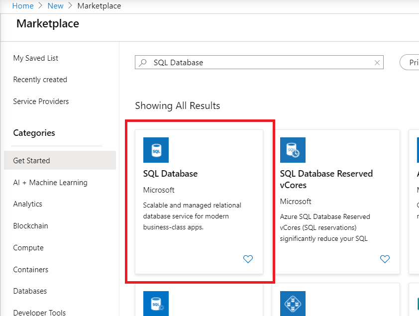
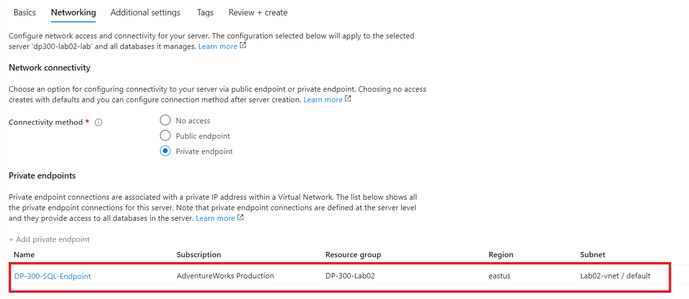
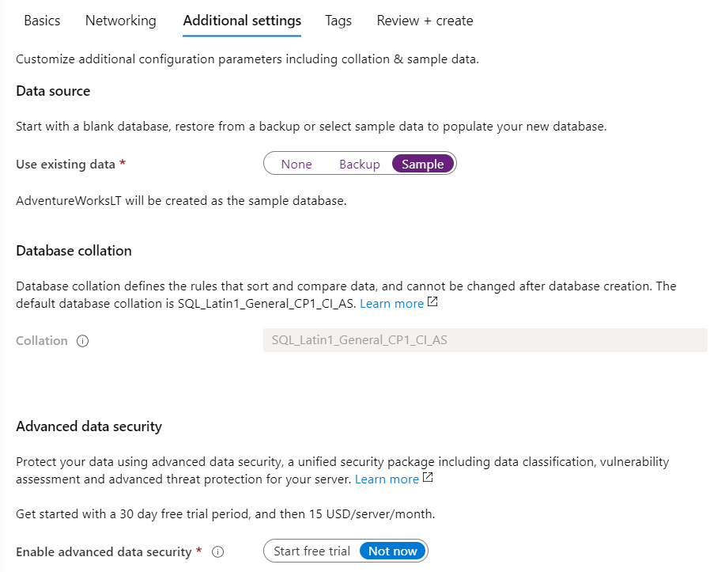
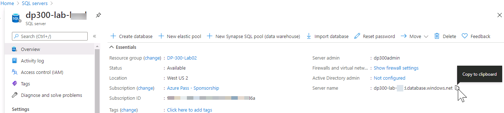

# Lab – Deploying PaaS databases

**Estimated Completion Time:** 35-40 minutes

**Pre-requisites:** None

**Lab files:** None

# Lab Overview

The student will deploy an Azure SQL Database with a Virtual Network Endpoint. Connectivity to the SQL Database will be validated from the lab VM.

# Lab Objectives

The students will:

1. Deploy an Azure SQL Database 

2. Connect to Azure SQL Database with SQL Management Studio

# Scenario

As a database administrator for AdventureWorks, you will set up a new SQL Database in Azure SQL

# Exercise 1: Deploy an Azure SQL Database

## Task 1: Deploy an Azure SQL Database

1. From the Azure Portal, click on **+ Create a Resource** at the top of the left side navigation bar  
‎
	

2. Search for “SQL database” in the search box at the top, then click **SQL Database** from the list of options  
‎
	

3. Click the **Create** button

4. Complete the Create SQL Database Basics screen with the following inputs and then click **Next: Networking**

	- Subscription: Select the lab subscription

	- Resource Group: **DP-300-Lab01** (the RG created in Lab A)

	- Database Name: **AdventureWorksLT**
	
	- Server: click **Create new.** In the New Server sidebar, complete the form as follows:

		- Server name: **dp300-lab-&lt;your initials (lower case)&gt;** (server name must be globally unique)

		- Server admin login: **dp300admin**

		- Password: **dp300P@ssword!**

		- Confirm password: **dp300P@ssword!**

		- Location: Select the Region nearest to you (same as in Lab A)

		- Your New server sidebar should look similar to the one below. Click **OK**

		

    -  Want to use Elastic Pool: **No**

    -  Compute + Storage: Click **Configure database**

		- On the Configure screen, click **Looking for basic, standard, premium?**

		

		- Click **Basic**

		- Click the **Apply** button

**Note: Make note of this server name, and your login information. You will use it in subsequent labs.**

5. Review settings and then click **Next: Networking**  
‎

6. On the Networking screen, for Connectivity method, click the **Private endpoint** radio button  
‎
	

7. Then click the **Add private endpoint** link under Private Endpoints  
‎
	

8. Complete the Create private endpoint flyout as follows:

	- Subscription: Ensure the lab subscription is selected

	- Resource group: **DP-300-Lab01**

	- Location: The same Region that was selected for previous parts of this lab

	- Name: **DP-300-SQL-Endpoint**

	- Target sub-resource: **SqlServer**

	- Virtual network: **DP-300-Lab01-vnet**

	- Subnet: **default (10.X.X.X/24)**

	- The Private DNS integration options can remain at the default

	- Click **OK**  

9. Confirm the endpoint appears on the Networking page, and then click the **Next: Additional settings** button.  
‎
	

10. On the Additional Settings page, select the following options:

	- Set Use existing data to **Sample**

	- Ensure enable advanced data security is set to **Not now**  
‎
	

11. Click **Review + Create**

12. Review the settings before clicking **Create**

13. Once the deployment is complete, click the **Go to resource** button  
‎

## Task 2: Enable All Azure Services access to new SQL Server

1. From the SQL Database blade, click on the link for the Server name in the top section  
‎

	

2. On the SQL Server object’s navigation blade, click **Firewalls and virtual networks** under Security

	‎

3. Set Allow Azure services and resources to access this server to **Yes**  
‎

	

4. Click **Save**

 

# Exercise 2: Connect to Azure SQL Database

1. In the search bar at the top of the Azure Portal, type SQL. The SQL servers icon will appear. Click on SQL servers. Click on the server name to be taken to the detail page for the server you created in previous exercise

	

 

2. In the detail screen for your SQL server, move your mouse to right of the server name, and click copy to clipboard button as shown below.

	

3. Open SQL Server Management Studio on the Azure SQL VM ( created on Lab-A , you may need to use RDP to connect ), by navigating to Microsoft SQL Server Tools 18 > SQL Server Management Studio from the Start menu. Paste in the name of your Azure SQL database server and login with the credentials you created in previous exercise:

	- Server name: <paste your Azure SQL database server name here> 
         
	 - Authentication: SQL Server Authentication  
	
	- Server admin login: **dp300admin**

	- Password: **dp300P@ssword!**

 
	

	Click Connect.

4. In Object Explorer expand Databases and you should able to see the sample Database Deployed in previous Exercise. 

 
	

## End Note

Proceed to Lab-C