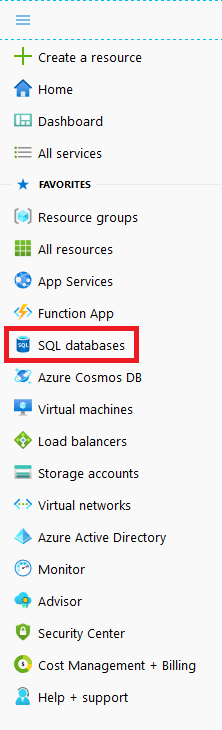
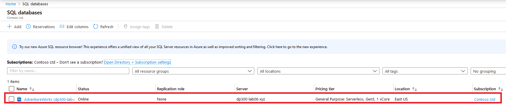
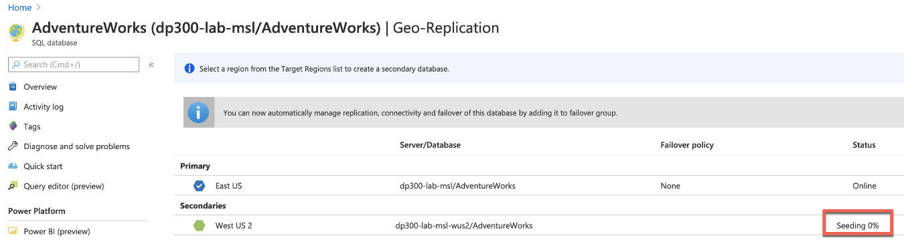

# Lab – Planning and Implementing a High Availability and Disaster Recovery Environment

**Estimated Time**: 90 minutes

**Pre-requisites**: Lab-A and Lab-B must be completed . 

**Lab files**: None

# Lab overview

The students will  make Azure SQL Database geo-redundant. 

# Lab objectives

After completing this lab, you will be able to:

- Enable geo-replication for Azure SQL Database

# Scenario

 As the Senior Data Engineer, you are tasked with improving the availability of PaaS configurations for your database environment. You are tasked with the following objectives:

- Enable geo-replication for Azure SQL Database to increase availability for a database.

# Exercise 1: Enable Geo-Replication for Azure SQL Database

1. If you are not logged into the Azure portal via a browser window, do so using the Azure credentials provided to you.

2. From the menu, select SQL databases as shown below.

	

3. Click on the Azure SQL Database that was created in Lab 3. An example is shown below.

	

 

4. In the blade for the database, under Settings, select Geo-Replication. 

	

	The region where the database is currently configured is shown in a blue hexagon with a white checkmark, as shown below. You will see that geo-replication is not configured.

	

5. Select a Target Region. All available regions will have a hexagon with a green outline.

	

6. In this example, West US 2 was selected as can be seen on the Create secondary blade. Select Target server.

	

7. Select Create a new server. On the New server blade, enter a name of module7geo (appended with your initials or a unique suffix), a valid admin login, and a secure password. Make a note of these credentials. Click Select when done.

	

8. Click **OK** on the Create secondary blade. The secondary server and the database will now be created. To check the status, look under the bell icon at the top of the portal. If successful, it will progress from Deployment in progress to Deployment succeeded. 

	

	You will also notice that on the Geo-Replicate page, the status column of the Secondary will go from Initializing, to a seeding percentage complete, as shown below, to Readable when the replication in syncrhonized

	

9. Now that the Azure SQL Database is configured with geo-replication, you will perform a failover. Select your secondary server (West US 2 as shown in the previous picture but you may have chosen a different region).

10. On the blade, click Forced Failover.

	

11. When prompted, click Yes. 

	

	The status of the primary replica will switch to Pending and the secondary, Failover. The process will take a few minutes. When complete, the roles will switch with the secondary becoming the new primary and the old primary becoming the secondary.

	

# THE END

### You have seen and done all the required hands on labs to become a Successful Azure Architect 

You need to complete the evaluation to generate certificate of Attendance. 

Please leave comment on the training and off course on Steve, Steve have put in so much effort to bring in the Labs from different Azure training into this AZ-303 delivery, so that you can get the best hands labs exercises, even you don't really use all the Azure Features in real life, as an Architect, you still need to know them.

You must not stop here, you should explore more scenarios to become a successful architect at Azure Architecture Center https://docs.microsoft.com/en-us/azure/architecture/browse/ 

Visit www.steven.com.my to get Steve's Contact info or 

Stay connected with Steve via LinkedIN :  www.linkedin.com/in/steven-nagendran-my 

### Cheers and Good Luck - Steven :) 

### Please visit this link to complete the training Evaluation: 

1. Microsoft Official training Delivered by MCT Evaluation:  https://www.metricsthatmatter.com/iversona54
 > **NOTE**: Please select **AZ-303 ( Mahalingam ), Steve's Surname (US naming convention)**

2. Iverson Evaluation Link:  https://feedback.iverson.com.my/ifs
 > **NOTE**: The class ID is **24707**,  Must complete this eval to generate the certificate of Attendance. Make sure you use a valid email address, certificates will be delivered via email. 